# SPOQ Master API Vision

> **One unified platform for all SPOQ data**

---

## 📋 Executive Summary

SPOQ Master API is our strategic initiative to **unify all SPOQ data** into a single, reliable source of truth.

**Key Points:**
- ✅ **One database** for all applications
- ✅ **Real-time sync** between legacy and new apps
- ✅ **Open platform** for partners and AI integrations

---

## 🔴 The Problem Today

### Current State: Fragmented Data

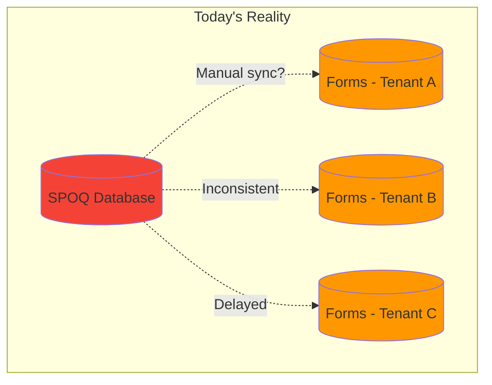

### Pain Points

| Issue | Impact |
|-------|--------|
| 🔄 **Data silos** | Same client exists differently in each system |
| ⏱️ **No real-time sync** | Changes take time to propagate |
| 🔧 **Hard to maintain** | Every new app needs custom integrations |
| 🚫 **No partner access** | External partners can't connect easily |
| 🤖 **No AI readiness** | Can't leverage modern automation tools |

---

## 🟢 The Solution: SPOQ Master API

### Central Hub Architecture

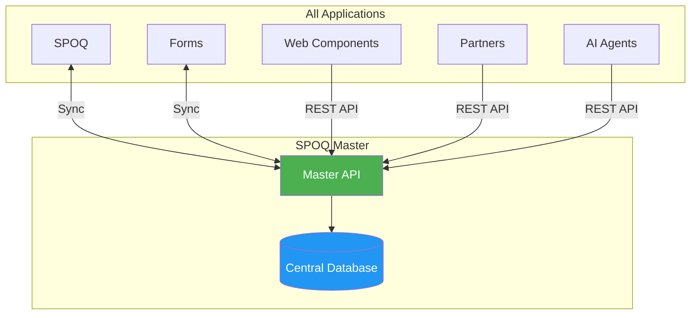

### Key Benefits

| Benefit | Description |
|---------|-------------|
| 🎯 **Single Source of Truth** | One database, one version of data |
| ⚡ **Real-time Updates** | Changes sync in less than 1 second |
| 🔌 **Easy Integration** | Standard REST API for all apps |
| 🤝 **Partner Ready** | External partners can connect via API |
| 🤖 **AI Ready** | Built for automation and AI tools |
| 🛡️ **Resilient** | If an app is down, data syncs automatically when it's back |

---

## ⚙️ How It Works

### Simple Flow

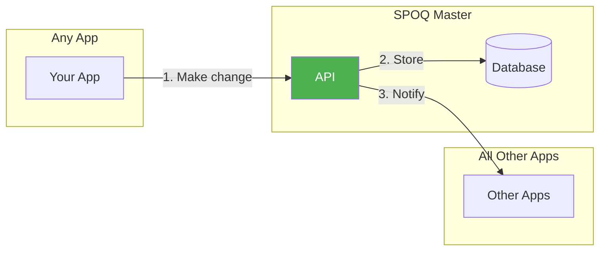

### What Happens When You Create a Job?

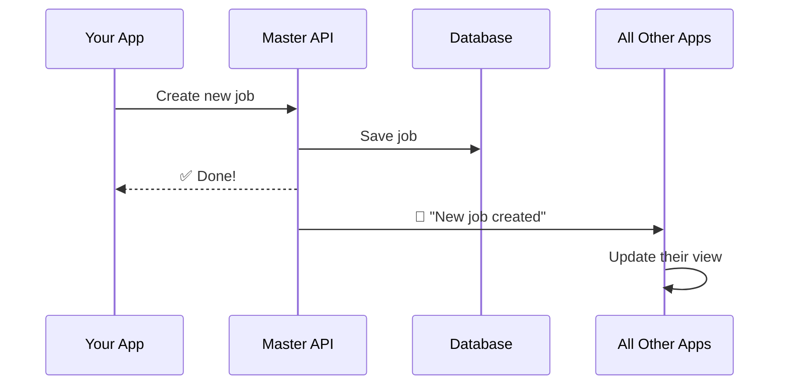

**Result:** All apps see the same job, instantly.

---

## 🗓️ Evolution Roadmap

### Three Phases

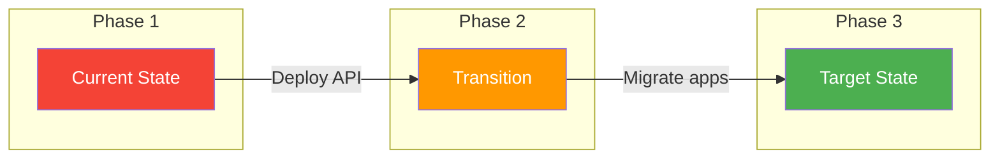

### Phase Details

| Phase | State | Description |
|-------|-------|-------------|
| **Phase 1** 🔴 | Current | Separate databases, no sync |
| **Phase 2** 🟠 | Transition | Master API + auto-sync with legacy apps |
| **Phase 3** 🟢 | Target | All apps use the API directly |

### Visual Timeline

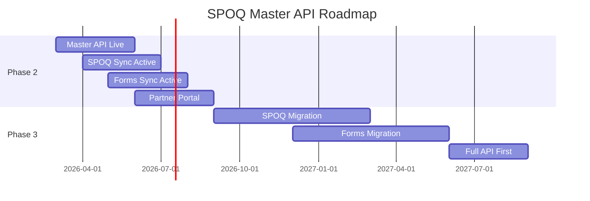

---

## 👥 Benefits for Stakeholders

### For Clients

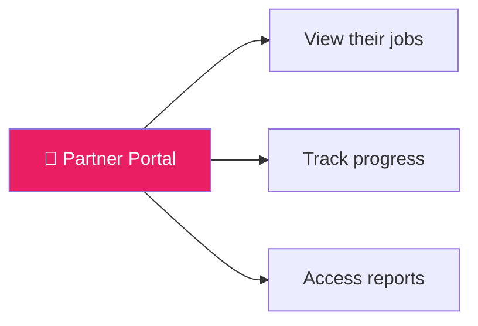

- ✅ Self-service portal to view their data
- ✅ Real-time status updates
- ✅ Direct access to reports and certificates

### For Partners

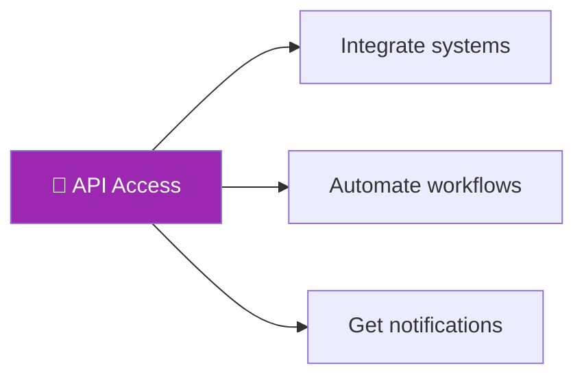

- ✅ Connect their own systems to SPOQ
- ✅ Receive webhooks for events
- ✅ Build custom integrations

### For Internal Team

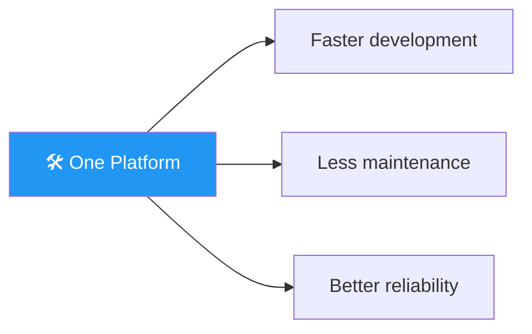

- ✅ Build new features faster
- ✅ One API to maintain, not many
- ✅ Clear data model

---

## 🔒 Security & Access Control

### Data Isolation

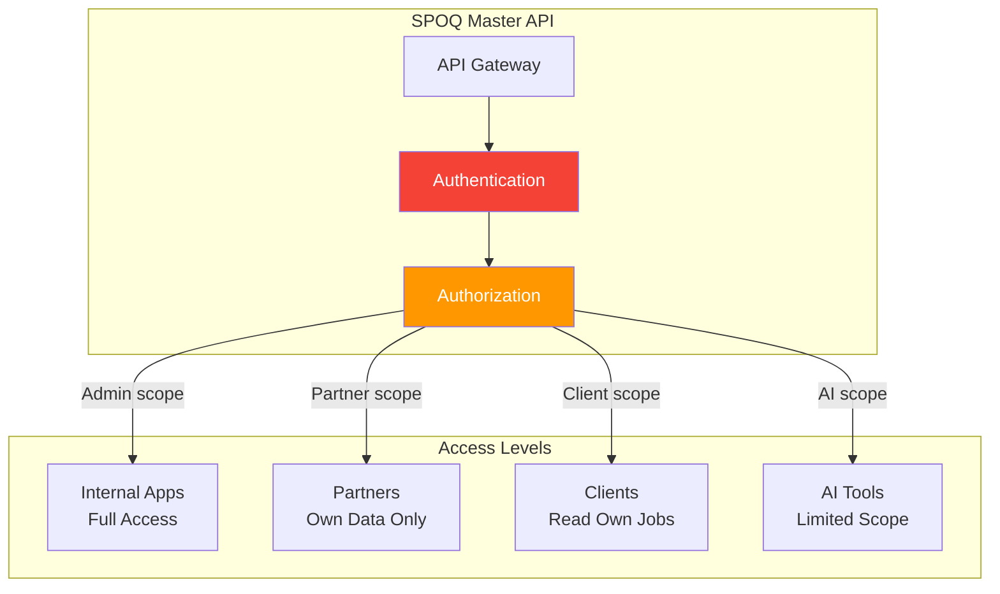

### Key Principles

| Principle | Description |
|-----------|-------------|
| 🔐 **Data Isolation** | Partners and clients only see their own data |
| 🎫 **Role-Based Access** | Different permissions for internal apps, partners, clients |
| 🤖 **AI Limitations** | Automation tools have restricted, read-only access |
| 🔑 **JWT Authentication** | Secure tokens via Keycloak |
| ⏱️ **Rate Limiting** | Request limits per user type to ensure fair usage |

### Who Sees What?

| User Type | Access | Rate Limit |
|-----------|--------|------------|
| **Internal Apps** | Full access to all data | Unlimited |
| **Partner** | Only their clients and jobs | 1000 req/min |
| **Client** | Only their own jobs and reports | 100 req/min |
| **AI Agent** | Limited queries, no sensitive data | 60 req/min |

---

## 🤖 AI-Ready Platform

### Modern Automation

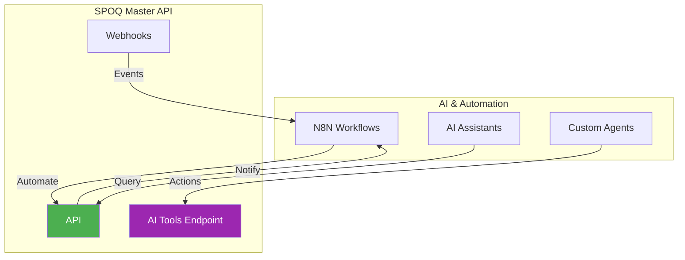

### Use Cases

| Automation | Description |
|------------|-------------|
| 📧 **Auto-notifications** | When job completes → Email client automatically |
| 📊 **CRM Sync** | New client → Create in Odoo |
| 🤖 **AI Assistant** | "Schedule an EPC inspection for client X" |
| 📋 **Reporting** | Daily job summary → Slack channel |

### AI Integration Features

- 📄 **llms.txt** - Machine-readable API description
- 🔧 **Tools Endpoint** - Ready for AI function calling
- 📡 **Webhooks** - Trigger automations on any event
- 📖 **Rich Documentation** - AI can understand and use the API

---

## 🚀 Next Steps

### Immediate Actions

### Key Milestones

| Milestone | Target |
|-----------|--------|
| ✅ Vision approved | This meeting |
| 🔧 Infrastructure ready | +2 weeks |
| 🚀 API deployed (staging) | +4 weeks |
| 🔗 First app connected | +6 weeks |
| 📢 Partner portal beta | +3 months |

---

## ❓ Questions?

### Key Points to Remember

1. **One database** = One source of truth
2. **Real-time sync** = No more inconsistencies
3. **Open platform** = Partners and AI can connect
4. **Secure by design** = Each user only sees their own data
5. **Gradual migration** = No big bang, step by step

---

*Document prepared for SPOQ Master API Vision Meeting - January 2026*
